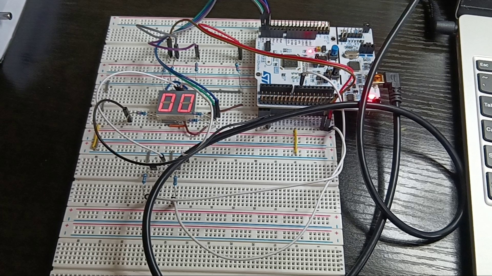
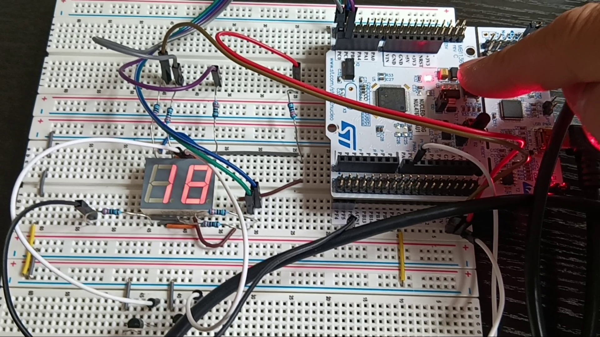

# Interrupt Controlled 7-Segment Display

## Overview

This project demonstrates a two-digit 7-segment counter using the STM32 NUCLEO-L476RG development board.

The display initially shows 00. The on-board user push button (PC13) is configured as an external interrupt source. Each button press increments the displayed value by one. After reaching 99, the counter rolls over to 00.

The two-digit display is driven using a multiplexing technique, while the user button is handled through an external interrupt (EXTI) to provide responsive counting without polling.

The system clock is configured to run at 80 MHz.

## Hardware

- STM32 NUCLEO-L476RG Development Board
- DC56-11EWA Two-Digit 7-Segment LED Display
- 2 × 2N2222A NPN Transistors
- 7 × 330Ω Resistors
- 2 × 1kΩ Resistors
- Breadboard
- Jumper Wires

## Segment Connections

| Function | STM32 Pin | Display Pin |
|----------|-----------|-------------|
| Segment a | PC0 | 16 |
| Segment b | PC1 | 15 |
| Segment c | PC2 | 3 |
| Segment d | PC3 | 2 |
| Segment e | PC4 | 1 |
| Segment f | PC5 | 18 |
| Segment g | PC6 | 17 |
| Digit 1 Enable | PC7 | 14 |
| Digit 2 Enable | PC8 | 13 |

## Interrupt Configuration

| Function | STM32 Pin |
|----------|-----------|
| User Button | PC13 |
| Green LED | PA5 |

### EXTI Configuration

- Falling-edge trigger
- EXTI Line 13
- NVIC EXTI15_10 interrupt enabled
- Preemption priority: 0

## Features

- Two-digit 7-segment display control
- Multiplexed display operation
- External interrupt handling using EXTI
- Push-button counter (00 to 99)
- Automatic rollover after 99
- Direct GPIO ODR register manipulation

## Display Encoding Table

| Digit | ODR Value |
|--------|-----------|
| 0 | `0x3F` |
| 1 | `0x06` |
| 2 | `0x5B` |
| 3 | `0x4F` |
| 4 | `0x66` |
| 5 | `0x6D` |
| 6 | `0x7D` |
| 7 | `0x07` |
| 8 | `0x7F` |
| 9 | `0x6F` |

## Project Structure

| Folder | Description |
|----------|-------------|
| Core | Application source and header files |
| Drivers | STM32 HAL and CMSIS drivers |
| Docs | Project documentation and schematic |
| Images | Hardware setup photos |

## Images

## Documentation

[Schematic PDF](INT_7_Segment/Docs/int_7_segment_schematic.pdf)

## Development Environment

- STM32CubeIDE
- STM32CubeMX
- STM32 HAL Drivers